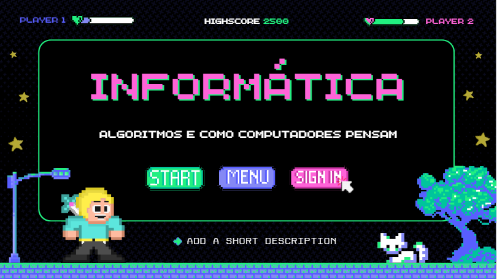
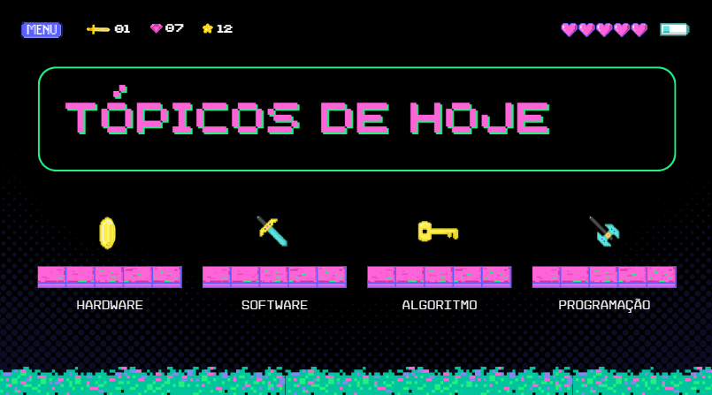
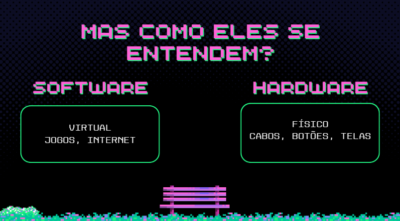

# Aula 2

**Assunto:** A aula foi voltada para contar se em algum determinado tempo na trajetória academica realizou
um projeto de extensão.

## **Minha Experiência:**

### Conectando Saberes

No dia 9 de junho de 2024, o PET Ciência da Computação iniciou visitas a escolas de Santa Maria 
como parte do projeto "Conectando Saberes".

Minha participação ocorreu no dia inicial, quando eu, juntamente com três colegas do curso de Ciência da Computação,
ministramos aulas para alunos do 6º ano do Ensino Fundamental na Escola Lívia Menna Barreto. Nosso objetivo foi introduzir 
conceitos básicos da área de computação de forma acessível e envolvente.
Abordamos tópicos como hardware, software, algoritmos e programação, destacando como esses elementos se interconectam.

As explicações foram estruturadas de maneira simples e didática para garantir a compreensão de todos os alunos.

Os slides foram criados com cores vibrantes, com objetivo de captar a atenção dos alunos
e tornar a apresentação mais chamativa aos alunos:

