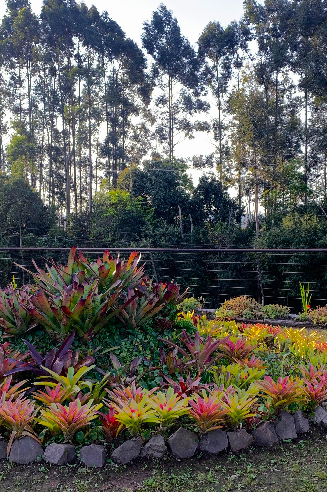
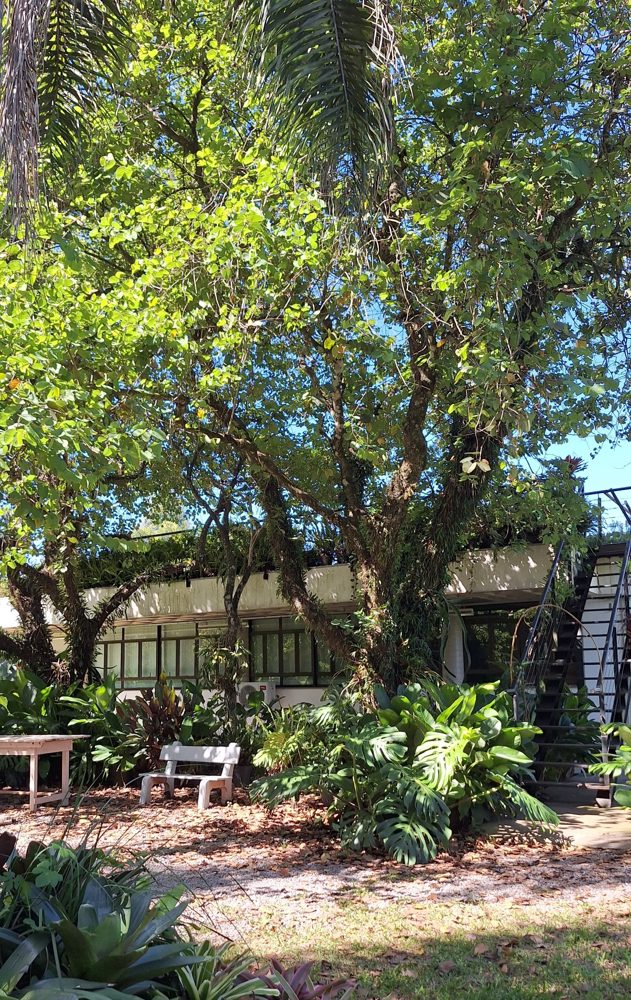

# Jardim Botânico
**Data da Aula:** 21/03/2025

**Assunto:** Visita ao Jardim Botânico da UFSM e reflexões sobre a 
interação com a natureza no contexto de extensão universitária.

---

## Visita ao Jardim Botânico
No dia 21 de março de 2025, realizei minha visita junto a turma ao Jardim Botânico da UFSM como parte das atividades da disciplina
de Práticas de Extensão.

O objetivo dessa visita foi explorar o Jardim Botânico e conhecer a ideia por trás do projeto do
jardim, sobre a relação entre a biodiversidade local e os projetos de extensão 
realizados pela universidade.
Durante a visita, tivemos uma experiência guiada por trilhas que permitiu observar o ambiente
diversas espécies vegetais e compreender sua importância no ecossistema.

- **Educação e Extensão:** Foi sugerido após um diálogo um possível potencial do uso espaço 
como ferramenta para possiveis melhorias das pessoas de fora conhecerem o local, destacando como ele pode ser integrado a ações de ensino e 
pesquisa, criando sistemas para reconhecimentos das trilhas, descrição mais completa a partir de um
QR code a cada planta.

Essa experiência nos permitiu compreender de forma prática a relevância de preservar e valorizar os recursos naturais, 
além de inspirar ideias para projetos futuros que unam educação, ciência e comunidade.

|  |  |
|-----------------------------------------|-----------------------------------------|
